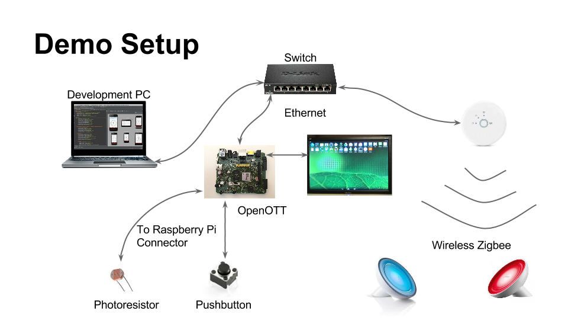

The project demonstrates OpenOTT I/O controlling Philips Hue Zigbee LightLink lamps via a Philips Hue IP bridge. It assumes that the Hue bridge has at least two lamps connected and that there is one (and only one) Hue IP bridge on the same network as the OpenOTT board.

You must have the 3.3v voltage over a photoresistor connected to the ADC on pin 40. For safety, the photoresistor should be in serial with a resistor, e.g. 10k ohm, to ensure that even if the photoresistor shorts, you do not short 3.3v to ground. The ADC input controls the intensity of the first Hue lamp. You can adjust the sensitivity of the ADC input via a UI slider, to compensate for the serial resistor's value and max/min lighting conditions.

Additionally you can connect a pushbutton to the GPIO on pin 5 to control the second lamp, although this is not stricly necessary as there is also a UI on/off switch for that. Pin 5 has I2C as alternate function, so it has a relatively high internal pull-up resistor. Consequently you must use an even lower pulldown - e.g. 1k ohm.
